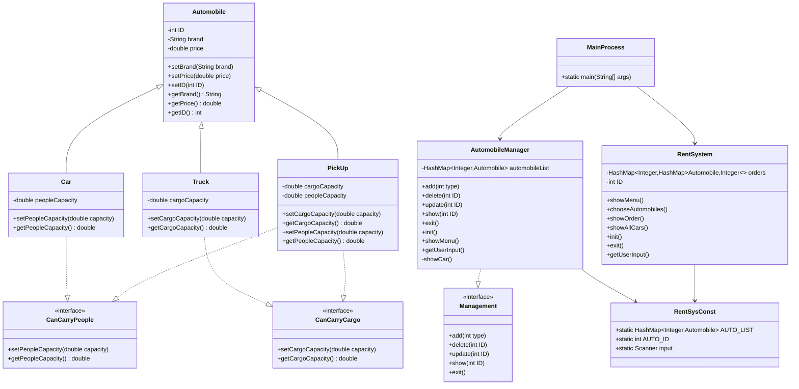

# 租车管理系统 - 项目结构说明

## 文件结构

```
rent_car.javahomework.3.2.2/
├── src/
│   ├── MainProcess.java    # 主程序文件（包含所有类）
│   └── Main.java          # 测试文件
├── out/                   # 编译输出目录
├── README.md             # 项目说明文档
├── 简历项目描述.md        # 简历用项目描述
├── 项目结构说明.md        # 本文件
└── rentcar.javawork.3.2.iml  # IntelliJ IDEA项目配置
```

## 代码结构分析

### MainProcess.java 文件内容

#### 1. 接口定义
```java
// 管理系统通用接口
interface Management
// 载货功能接口  
interface CanCarryCargo
// 载人功能接口
interface CanCarryPeople
```

#### 2. 实体类
```java
// 汽车基类
class Automobile
// 轿车类
class Car extends Automobile implements CanCarryPeople
// 卡车类  
class Truck extends Automobile implements CanCarryCargo
// 皮卡类
class PickUp extends Automobile implements CanCarryCargo, CanCarryPeople
```

#### 3. 业务类
```java
// 汽车管理器
class AutomobileManager implements Management
// 租车系统
class RentSystem
// 全局常量类
class RentSysConst
```

#### 4. 主程序类
```java
// 程序入口
public class MainProcess
```

## 类关系图



## 功能模块说明

### 1. 汽车管理模块
- **核心类**：`AutomobileManager`
- **功能**：汽车的增删改查操作
- **特点**：实现`Management`接口，提供统一的管理操作

### 2. 租车业务模块  
- **核心类**：`RentSystem`
- **功能**：汽车租赁、订单管理
- **特点**：独立的业务逻辑，与管理模块分离

### 3. 汽车实体模块
- **基类**：`Automobile`
- **子类**：`Car`、`Truck`、`PickUp`
- **特点**：继承体系清晰，功能接口明确

### 4. 数据管理模块
- **核心类**：`RentSysConst`
- **功能**：全局数据存储和状态管理
- **特点**：静态成员，全局访问

## 设计模式应用

### 1. 接口模式
- `Management`接口：定义管理操作规范
- `CanCarryPeople`、`CanCarryCargo`：定义功能契约

### 2. 继承多态
- `Automobile`基类：定义通用属性
- 子类实现：特定功能的具体实现

### 3. 策略模式
- 不同车型实现不同的功能接口
- 运行时根据类型选择相应策略

## 数据流向

### 汽车管理流程
```
用户输入 → AutomobileManager → RentSysConst.AUTO_LIST → 数据操作
```

### 租车业务流程  
```
用户选择 → RentSystem → RentSysConst.AUTO_LIST → 订单创建
```

### 系统初始化流程
```
MainProcess.main() → 初始化管理器 → 初始化租车系统 → 用户交互循环
```

## 代码质量特点

### 1. 注释完整
- 所有类和方法都有JavaDoc注释
- 关键代码逻辑有行内注释
- 注释内容详细，便于理解

### 2. 命名规范
- 类名采用大驼峰命名法
- 方法名采用小驼峰命名法  
- 常量采用全大写下划线分隔

### 3. 结构清晰
- 接口、类、方法组织有序
- 功能模块分离明确
- 代码层次分明

### 4. 异常处理
- 输入验证和错误提示
- 边界条件检查
- 用户友好的错误信息

## 扩展建议

### 1. 功能扩展
- 添加更多车型
- 实现复杂的租赁业务逻辑
- 增加用户管理功能

### 2. 技术升级
- 数据库持久化
- Web界面开发
- 多线程支持

### 3. 架构优化
- 引入设计模式（工厂模式、观察者模式）
- 分层架构设计
- 配置文件管理

这个项目结构展现了良好的Java编程基础和面向对象设计能力，是学习和展示编程技能的优秀案例。
